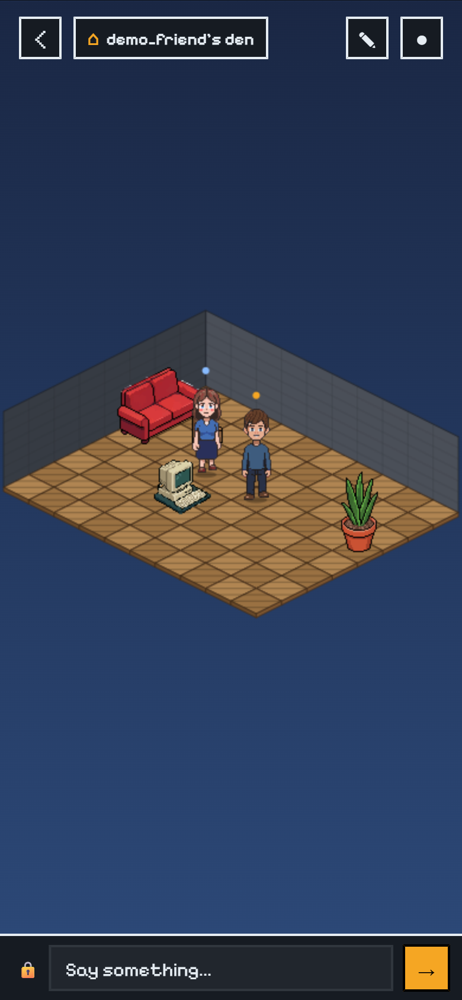

# Den

Mobile encrypted messenger. Opening a chat with a friend takes you into their pixel-art room where both customised avatars can hang out while messages flow E2E-encrypted in the background.

## Stack

- **mobile/** — Flutter + Flame (iOS + Android). Classic Habbo 64×32 isometric projection, sprite-based furniture, programmatic walls/floors.
- **preview/** — Browser preview of the room renderer that mirrors `mobile/lib/features/room/*` 1:1. Used for iteration before touching Flutter.
- **server-api/** — Fastify + PostgreSQL. Auth, avatar config, room config, friends, Signal Protocol key bundles, encrypted message store.
- **server-rooms/** — uWebSockets.js + Redis. Live avatar position/chat relay. Blind to chat payloads — only relays Signal envelopes.
- **tools/** — PixelLab generation + sprite normalisation scripts.
